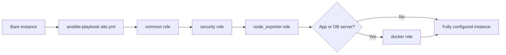
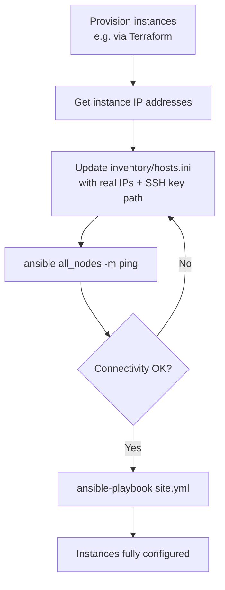

# Baseline Automation - Ansible Instance Bootstrapping & Configuration Management

Ansible automation that takes a bare Linux instance and brings it to a fully configured, production-ready baseline: system updates, hardened firewall rules, a monitoring agent, and a container runtime — applied consistently and repeatably across any number of servers.

## Overview

Manually configuring servers one at a time doesn't scale and isn't repeatable. This project defines the target state of an instance as code (a set of Ansible playbooks and roles) so that any server — local, staging, or production — can be brought to the same known-good configuration with a single command.



## What it configures

| Role | Responsibility |
|---|---|
| `common` | OS package updates, base utilities, non-root deploy user, timezone and clock sync |
| `security` | Firewall rules (UFW) restricted to required ports, SSH hardening (no root login, no password auth) |
| `node_exporter` | Installs Prometheus Node Exporter as a systemd service, exposing host metrics for scraping |
| `docker` | Installs Docker Engine and the Compose plugin on application and database hosts |

Each role is idempotent — running the playbook repeatedly converges the instance to the same state rather than accumulating changes.

## Repository structure

```
.
├── ansible.cfg              # Ansible runtime configuration
├── site.yml                 # Entry-point playbook
├── Vagrantfile              # Local test VM definition
├── inventory/
│   ├── hosts.ini             # Target hosts (edit for real deployments)
│   └── hosts_local.ini       # Inventory used by the local Vagrant test VM
├── group_vars/
│   └── all.yml               # Shared variables (versions, package lists)
└── roles/
    ├── common/
    ├── security/
    ├── node_exporter/
    └── docker/
```

## Prerequisites

- [Ansible](https://docs.ansible.com/) ≥ 2.15 (control node — Linux/macOS, or WSL on Windows)
- Target hosts running Ubuntu 22.04 (or compatible)
- SSH key-based access to target hosts, for real deployments
- [VirtualBox](https://www.virtualbox.org/) and [Vagrant](https://developer.hashicorp.com/vagrant/) for local testing (optional but recommended)

## Usage

### Local testing (no cloud account required)

The included `Vagrantfile` provisions a local VM and runs the playbook against it automatically — useful for validating changes before targeting real infrastructure.

```bash
vagrant up          # boots the VM, installs Ansible inside it, and runs the playbook
vagrant ssh          # log in to inspect the result
exit
```

Verify the outcome from inside the VM:

```bash
curl localhost:9100/metrics   # Node Exporter is serving metrics
docker --version              # Docker installed
sudo ufw status                 # firewall rules applied
```

### Running against real infrastructure



1. Update `inventory/hosts.ini` with the target IP addresses, SSH user, and private key path.
2. Verify connectivity:
   ```bash
   ansible all_nodes -m ping
   ```
3. Run the playbook:
   ```bash
   ansible-playbook site.yml
   ```

## Design notes

- **Declarative, not scripted.** Roles describe the desired end state; Ansible determines the steps to reach it. This keeps the automation predictable and safe to re-run.
- **Local-first validation.** Every role is exercised against a disposable local VM before ever touching real infrastructure, avoiding cost and risk during development.
- **Separation of concerns.** This project is scoped to instance-level bootstrapping and configuration. Infrastructure provisioning (creating the instances themselves) is treated as a separate, upstream concern — this playbook is agnostic to where an instance came from, as long as it's reachable over SSH.

## Roadmap

- Automated remediation and rollback on configuration drift
- Support for dynamic inventory (auto-discovering instances from a cloud provider)
- Role for horizontal scaling / instance resizing triggers
